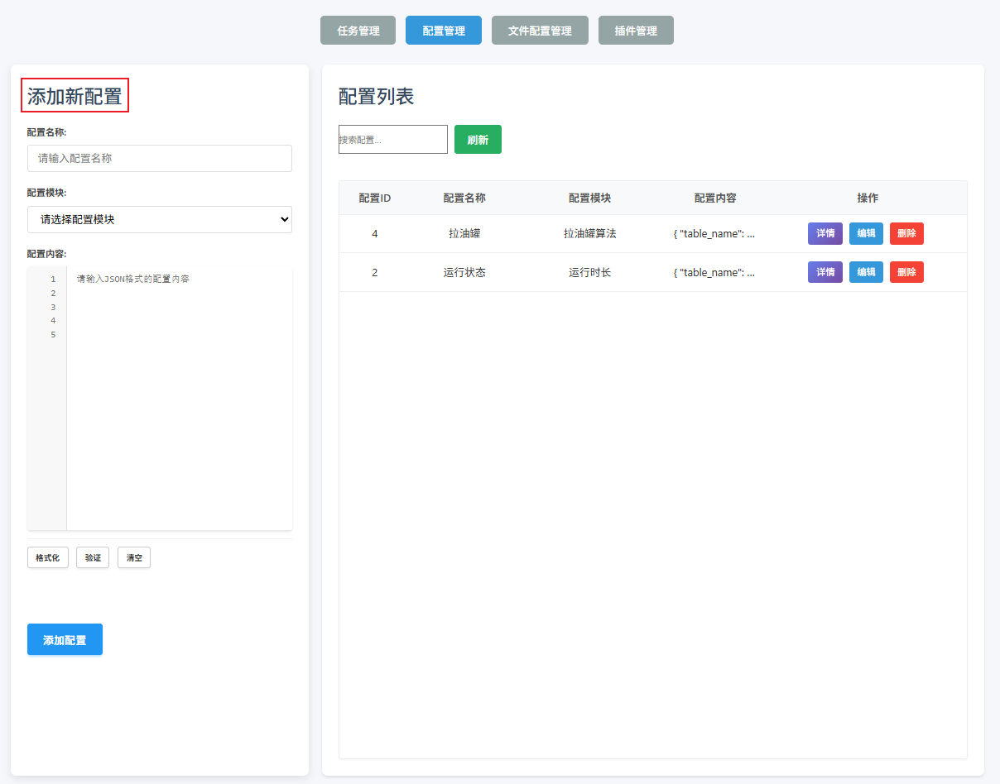
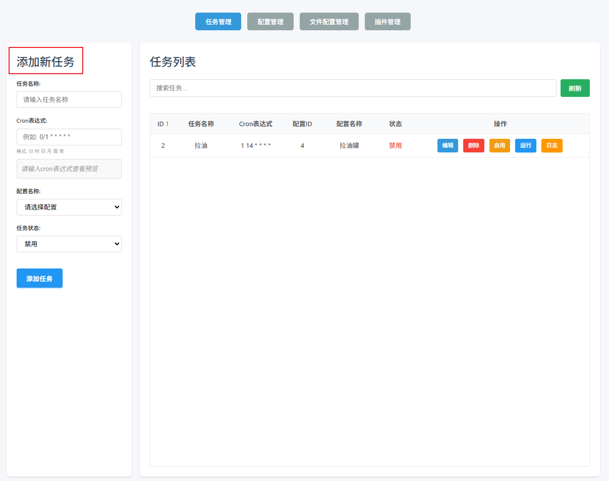

# 任务配置流程

**1.上传配置文件**

```text
如果该任务需要读取配置文件，需要优先上传相关配置文集，基本都为csv文件
```

**2.配置任务配置**

配置管理界面



```text
在配置管理界面配置任务的相关信息（例）：
	任务名称：  测试任务
	配置模块：  拉油罐算法
    配置内容：  {
				  "table_name": "t_daily_layou",  
				  "task_file": "拉油罐.csv",
				  "interval_time": ["day", 14]
			   }
			  说明：table_name ：入库数据表名   task_file： 执行读取的配置文件  interval_time拉油算法周期信息
```

‍

**3.任务执行周期配置**



```text
配置任务的执行周期（例）：
	任务名称： 拉油罐定时器1
	Cron表达式: 1 14 * * * *
	配置名称： 测试任务  //上面的配置名称
	任务状态： 禁用/启用
```

‍
